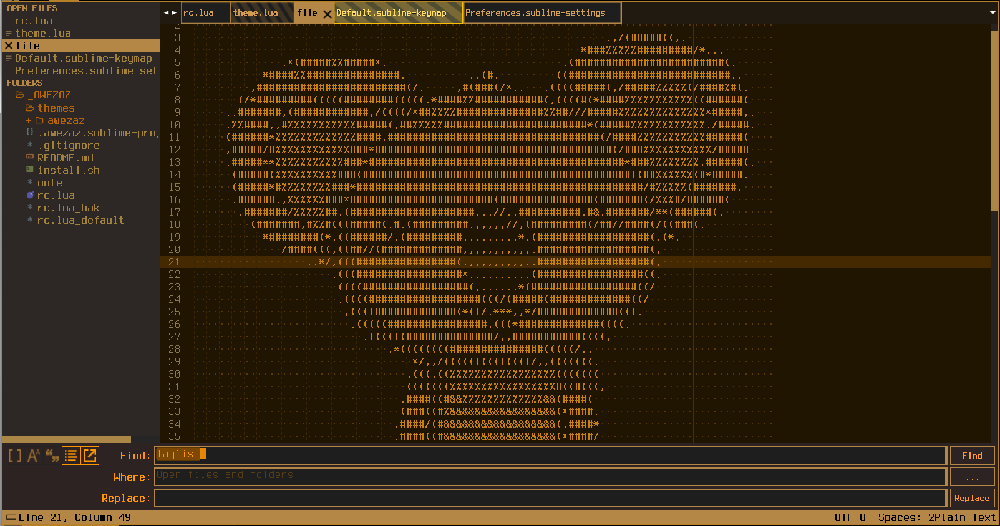
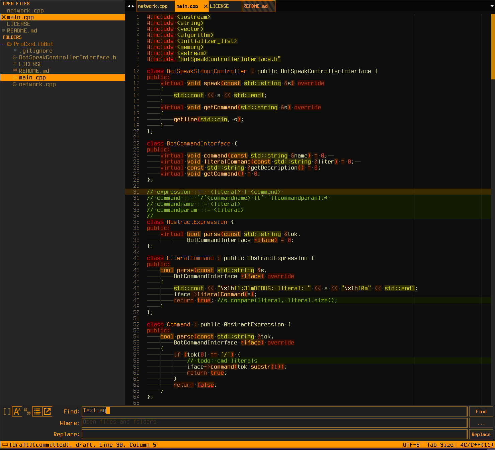
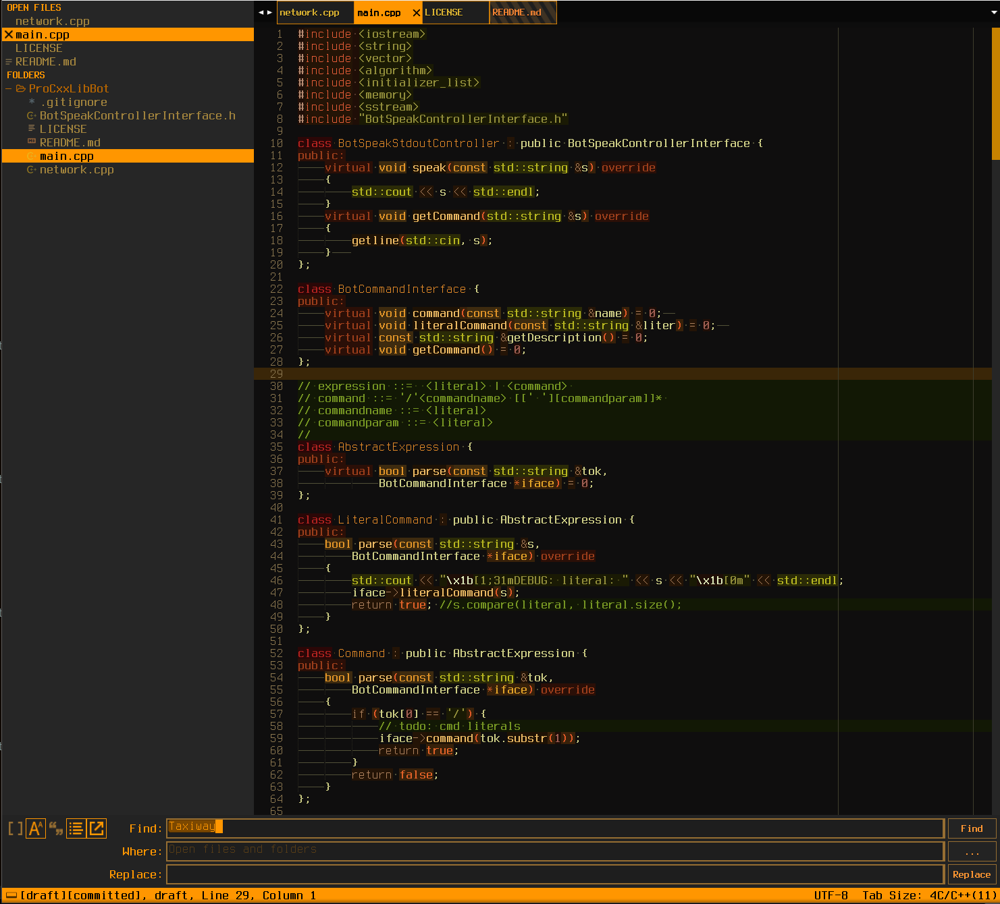

# industrial_coding

industrial_coding is a minimal dark Theme for Sublime Text 3. Also it is a syntax color scheme. The theme is based on the great theme [Afterglow](https://github.com/YabataDesign/afterglow-theme).

## Design & Colors







---

<h6 align='center'><code>supa</code>bleak</h6>


## Installation


### Git Installation

Locate your Sublime Text 'Packages directory' by using the menu item 'Preferences -> Browse Packages...' .

Then, clone the repository using this command:

    git clone https://github.com/zaizupro/industrial-coding-theme.git


### Manual installation

* Download the [GitHub .zip](https://github.com/zaizupro/industrial-coding-theme/archive/master.zip)
* Unzip the files and rename the folder to 'industrial-coding-theme'.
* Find your 'Packages' directory using the menu item  'Preferences -> Browse Packages...'
* Copy the folder into your Sublime Text 'Packages' directory.


---

### Activation

###### Recommended

Open command palette via `Tools > Command Palette` (or <kbd>cmd/ctrl</kbd> + <kbd>shift</kbd> + <kbd>p</kbd>) and type `ict: Activate theme`.


###### Via Preferences

Activate this theme and color scheme by modifying your user preferences file, which you can find using the menu item 'Sublime Text -> Preferences -> Settings - User'.

Then add the following code settings. **(After activating the theme, you must restart Sublime Text.)**


**normal colors**
```js
{
    "theme": "industrial_coding.sublime-theme",
    "color_scheme": "Packages/industrial-coding-theme/industrial_coding_normal.tmTheme"
}
```

**bleak colors**
```js
{
    "theme": "industrial_coding.sublime-theme",
    "color_scheme": "Packages/industrial-coding-theme/industrial_coding_bleak.tmTheme"
}
```

For supableak theme:

```js
"theme": "industrial_coding.sublime-theme",
"color_scheme": "Packages/industrial-coding-theme/industrial_coding_supableak.tmTheme",
```

---

## Configuration
### Settings

```js
    "mouse_wheel_switches_tabs":    true, // comment

    "font_terminus":                true, // set custom font and size for elements
					  // marked as "MARKER FOR REPLACING WITH UR FONT"
				          // in 'industrial_coding.sublime-theme' file
					  // default - Terminus

    "show_tab_close_buttons":       true, // show x on tabs

    "bold_folder_labels":           true, // bold font on sidebar folders labels 

    "bold_sidebar_labels":          true, // bold font on sidebar entry labels

    "sidebar_font_nobold":          true, // no-bold font in side bar

    "statusbar_big_bold":           true, // big bold status bar font for terminus

    "sidebar_no_icon":              true, // deprecated

    "folder_no_icon":               true, // show/hide folder icon in side bar
```
