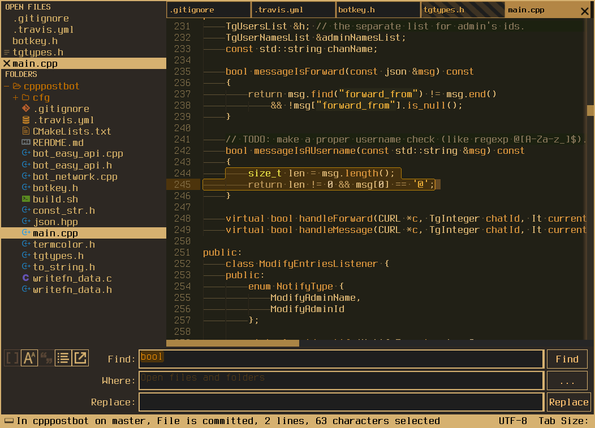

[](https://github.com/zaizupro/industrial-coding-theme/blob/master/LICENSE)


# industrial-coding-theme


industrial_coding is a minimal dark Theme for Sublime Text 3. Also it is a syntax color scheme.

---

## Design & Colors

---

<h6 align='center'><code>supa</code>bleak</h6>



## Installation:

### via Package Control

1. Make sure you already have [Package Control](https://packagecontrol.io/installation) installed.
2. Choose Install Package from the Command Palette (via `Tools > Coomand Palette` from the main menu or <kbd>cmd/ctrl</kbd> + <kbd>shift</kbd> + <kbd>p</kbd>).
3. Select **`industrial coding theme`** and press <kbd>Enter</kbd>.

### or Manual Installation

* Find your 'Packages' directory using the menu item  `Preferences -> Browse Packages...`
* Download the [GitHub .zip](https://github.com/zaizupro/industrial-coding-theme/archive/master.zip)
* Unzip the files into your Sublime Text `Packages/User/` directory.

or

* Clone the repository
     `git clone https://github.com/zaizupro/industrial-coding-theme.git` into your Sublime Text `Packages/User/` directory.


---

### Activation

###### Via Command Palette (Recommended)

Open command palette via `Tools > Command Palette` (or <kbd>cmd/ctrl</kbd> + <kbd>shift</kbd> + <kbd>p</kbd>) and type `ICT: Activate theme`.


###### Via Preferences

Activate this theme and color scheme by modifying your user preferences file, which you can find using the menu item 'Sublime Text -> Preferences -> Settings - User'.

Then add the following code settings.


**normal colors**
```js
    "theme": "industrial_coding.sublime-theme",
    "color_scheme": "Packages/User/industrial-coding-theme/industrial_coding_normal.tmTheme"
```

**bleak colors**
```js
    "theme": "industrial_coding.sublime-theme",
    "color_scheme": "Packages/User/industrial-coding-theme/industrial_coding_bleak.tmTheme"
```

For supableak theme:

```js
"theme": "industrial_coding.sublime-theme",
"color_scheme": "Packages/User/industrial-coding-theme/industrial_coding_supableak.tmTheme",
```

---

## Configuration
### Settings

```js
    "mouse_wheel_switches_tabs":    true, // comment

    "font_terminus":                true, // set custom font and size for elements
                                          // marked as "MARKER FOR REPLACING WITH UR FONT"
                                          // in 'industrial_coding.sublime-theme' file
                                          // default - Terminus

    "show_tab_close_buttons":       true, // show x on tabs

    "bold_folder_labels":           true, // bold font on sidebar folders labels

    "bold_sidebar_labels":          true, // bold font on sidebar entry labels

    "sidebar_font_nobold":          true, // no-bold font in side bar

    "statusbar_big_bold":           true, // big bold status bar font for terminus

    "sidebar_no_icon":              true, // deprecated

    "folder_no_icon":               true, // show/hide folder icon in side bar
```


## LICENSE ##

Copyright (c) 2018 ZaizuPro

See [`LICENSE`](./LICENSE) for details.

